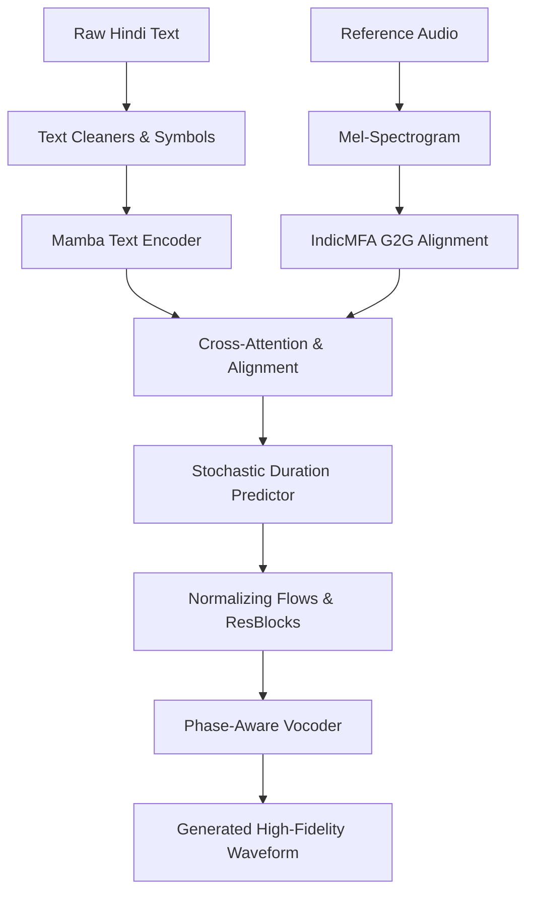

# TTS_Hindi: Expressive Hindi Text-to-Speech Synthesis

## 📖 Overview
**TTS_Hindi** is a state-of-the-art Text-to-Speech (TTS) synthesis system explicitly designed to capture the cultural and linguistic nuances of the Hindi language. 

Built upon the robust [VITS](https://arxiv.org/abs/2106.06103) architecture, our model introduces **Mamba Core blocks** to replace traditional Transformer blocks. This modification vastly improves long-range dependency modeling and phonetic context awareness. Additionally, we integrate a custom **Grapheme-to-Grapheme (G2G)** alignment setup using **IndicMFA**, allowing for precise, high-fidelity audio generation in both single-speaker and multi-speaker scenarios.

👉 **[Listen to our Public Audio Demonstration Here!](https://speechforge.github.io/TTS_JD/)**

---

## 🧠 Core Ideas & Architecture

The architecture of TTS_Hindi is driven by three major improvements over traditional end-to-end TTS models:

1. **Mamba-based Text Encoder**: 
   Instead of using standard Transformer self-attention, the Text Encoder utilizes **State Space Models (Mamba)**. Mamba blocks allow the network to handle long Hindi sequences with near-linear complexity while maintaining a global receptive field, resulting in much more natural prosody without the quadratic computational bottleneck.
   
2. **IndicMFA G2G Alignment**: 
   Standard Grapheme-to-Phoneme (G2P) processes often struggle with the exact pronunciations of complex Hindi words. We bypass this by using a Grapheme-to-Grapheme (G2G) approach combined with the AI4Bharat **IndicMFA** (Montreal Forced Aligner). This forces the model to align audio to exact characters, preserving the deep linguistic structure.

3. **Stochastic Duration Prediction**: 
   Adapted from the most recent advancements in expressive TTS, the duration predictor models a *distribution* of possible durations for each phoneme rather than predicting a fixed length. This gives the final audio a natural, human-like rhythm and varied emotional pacing.

### System Flow


---

## 🛠️ Setup & Installation

### 1. Clone the Repository
```bash
git clone https://github.com/speechforge/TTS_Hindi.git
cd TTS_Hindi
```

### 2. Environment Setup
It is highly recommended to use Conda for managing dependencies:
```bash
conda create -n tts_hindi python=3.10
conda activate tts_hindi
```

### 3. Install Requirements
Install the core PyTorch dependencies and standard TTS requirements:
```bash
pip install -r requirements.txt
```
To install the dependencies for the Mamba blocks:
```bash
pip install -r requirements-mamba.txt
```

### 4. IndicMFA Setup
Please navigate to the `IndicMFA/` directory and follow the instructions in the `README.md` to properly clone and configure the Montreal Forced Aligner environment.

---

## 🚀 Usage

### Configuration
All hyperparameters and file paths are managed within `configs/hindi_tts.config`. Make sure to update the generic placeholders (`</path/to/your/...>`) with your actual dataset directories before training or inference.

### Training
To train the model from scratch or resume from a checkpoint:
```bash
python train_ms.py -c configs/hindi_tts.config -m my_hindi_model
```

### Inference
To generate speech using your trained weights:
```bash
python infer.py -c configs/hindi_tts.config -m my_hindi_model --text "नमस्ते, आप कैसे हैं?"
```
